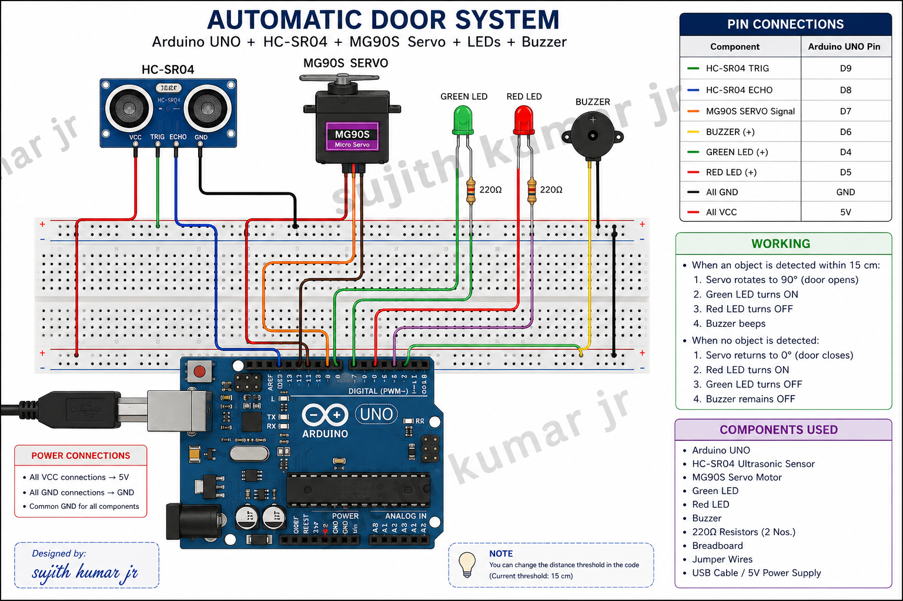

# Automatic Door System using Arduino

An automatic door system designed using an Arduino UNO, HC-SR04 ultrasonic sensor, and MG90S servo motor. The system detects a person or object approaching the door and automatically opens or closes the door based on the detected distance.

## Project Description

The Automatic Door System is a simple embedded-system project that demonstrates automatic door control using an ultrasonic sensor and servo motor.

The HC-SR04 ultrasonic sensor continuously measures the distance of an object in front of the door. When an object is detected within a predefined distance, the Arduino UNO commands the MG90S servo motor to open the door.

When the object moves away, the servo motor returns the door to its closed position.

## Objectives

- To design a simple automatic door system.
- To detect objects using an ultrasonic sensor.
- To control a servo motor using Arduino UNO.
- To demonstrate sensor-based automation.
- To provide a foundation for smart-home and access-control applications.

## Components Used

- Arduino UNO
- HC-SR04 Ultrasonic Sensor
- MG90S Servo Motor
- Green LED
- Red LED
- Buzzer
- Breadboard
- Jumper Wires
- USB Cable / Power Supply

## Circuit Diagram



## Pin Connections

| Component | Pin | Arduino Pin |
|---|---|---|
| HC-SR04 | TRIG | D9 |
| HC-SR04 | ECHO | D8 |
| MG90S Servo | Signal | D7 |
| Buzzer | Positive | D6 |
| Green LED | Positive | D4 |
| Red LED | Positive | D5 |

### Power Connections

- HC-SR04 VCC → Arduino 5V
- HC-SR04 GND → Arduino GND
- Servo VCC → 5V
- Servo GND → GND
- LEDs are connected through suitable current-limiting resistors.

## Working Principle

The HC-SR04 ultrasonic sensor sends an ultrasonic pulse and receives the reflected signal from an object.

The Arduino calculates the distance using the time taken for the ultrasonic wave to return.

### When an object is detected within 15 cm:

- The servo motor rotates to approximately 90°.
- The door opens.
- Green LED turns ON.
- Red LED turns OFF.
- Buzzer provides an alert.

### When no object is detected:

- The servo motor returns to approximately 0°.
- The door closes.
- Red LED turns ON.
- Green LED turns OFF.
- Buzzer remains OFF.

## System Flow

```text
Object Detection
       ↓
HC-SR04 Measures Distance
       ↓
Arduino UNO Processes Distance
       ↓
Is Distance ≤ 15 cm?
      / \
    YES  NO
     ↓    ↓
Servo 90°  Servo 0°
Door Open  Door Closed
     ↓    ↓
## Applications

- Automatic doors in homes and offices
- Smart building systems
- Access-control systems
- Hands-free door operation
- Smart-home automation

## Advantages

- Simple and low-cost design
- Automatic operation
- Contactless object detection
- Easy to implement
- Suitable for small embedded-system projects

## Future Enhancements

- Add RFID-based access control
- Add Wi-Fi/Bluetooth monitoring
- Add an LCD/OLED display
- Add a camera for identification
- Use a stronger motor for real doors

## Project Demonstration

The project detects an approaching object using the HC-SR04 ultrasonic sensor and automatically controls the MG90S servo motor to open and close the door.

## Author

Created as an Arduino-based embedded systems project.
Green LED  Red LED
Buzzer ON  Buzzer OFF
