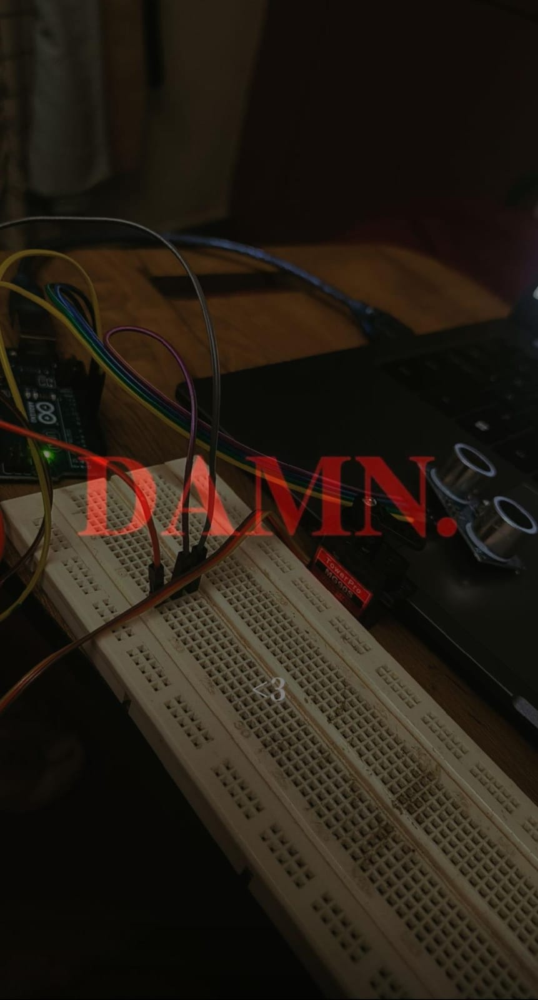

# Automatic Door System using Arduino

An automatic door system designed using an **Arduino UNO**, **HC-SR04 ultrasonic sensor**, and **MG90S servo motor**. The system detects a person or object approaching the door and automatically opens or closes the door based on the detected distance.

## Project Description

The **Automatic Door System** is a simple embedded-system project that demonstrates automatic door control using an ultrasonic sensor and a servo motor.

The **HC-SR04 ultrasonic sensor** continuously measures the distance of an object in front of the door. When an object is detected within a predefined distance, the Arduino UNO commands the **MG90S servo motor** to open the door.

When the object moves away from the detection range, the servo motor returns the door to its closed position.

The system also uses **green and red LEDs** to indicate the door status and a **buzzer** to provide an alert when the door is opened.

## Objectives

- To design a simple automatic door system.
- To detect objects using an ultrasonic sensor.
- To control a servo motor using Arduino UNO.
- To demonstrate sensor-based automation.
- To provide visual and audio status indications.
- To understand the basic operation of an embedded control system.
- To provide a foundation for smart-home and access-control applications.

## Components Used

- Arduino UNO
- HC-SR04 Ultrasonic Sensor
- MG90S Servo Motor
- Green LED
- Red LED
- Buzzer
- Breadboard
- Jumper Wires
- 220Ω Resistors
- USB Cable / Power Supply

## Circuit Diagram

The complete circuit connection is shown below.


## Project Photograph

The following image shows the physical prototype of the automatic door system.



## Pin Connections

| Component | Pin | Arduino Pin |
|---|---|---|
| HC-SR04 | TRIG | D9 |
| HC-SR04 | ECHO | D8 |
| MG90S Servo | Signal | D7 |
| Buzzer | Positive | D6 |
| Green LED | Positive | D4 |
| Red LED | Positive | D5 |

### Power Connections

- HC-SR04 VCC → Arduino 5V
- HC-SR04 GND → Arduino GND
- MG90S Servo VCC → 5V
- MG90S Servo GND → GND
- Green LED → D4 through a 220Ω resistor
- Red LED → D5 through a 220Ω resistor
- Buzzer positive → D6
- Buzzer negative → GND
- All components share a common ground.

> **Note:** For a larger or higher-load servo, an external 5V power supply may be required. The external supply ground must be connected to the Arduino GND.

## Working Principle

The **HC-SR04 ultrasonic sensor** sends an ultrasonic pulse and receives the reflected signal from an object.

The Arduino UNO calculates the distance using the time taken for the ultrasonic wave to travel to the object and return.

The calculated distance is then compared with a predefined threshold of **15 cm**.

### When an object is detected within 15 cm

- The servo motor rotates to approximately **90°**.
- The door opens.
- The green LED turns **ON**.
- The red LED turns **OFF**.
- The buzzer turns **ON**.

### When no object is detected within 15 cm

- The servo motor returns to approximately **0°**.
- The door closes.
- The red LED turns **ON**.
- The green LED turns **OFF**.
- The buzzer turns **OFF**.

## System Flow

```text
Object Detection
       ↓
HC-SR04 Measures Distance
       ↓
Arduino UNO Processes Distance
       ↓
Is Distance ≤ 15 cm?
      / \
    YES  NO
     ↓    ↓
 Servo 90°  Servo 0°
     ↓    ↓
 Door Open  Door Closed
     ↓    ↓
Green LED  Red LED
     ↓    ↓
Buzzer ON  Buzzer OFF
